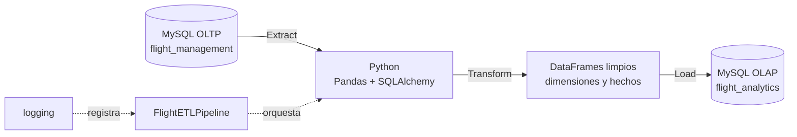
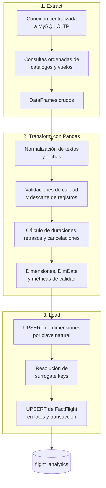
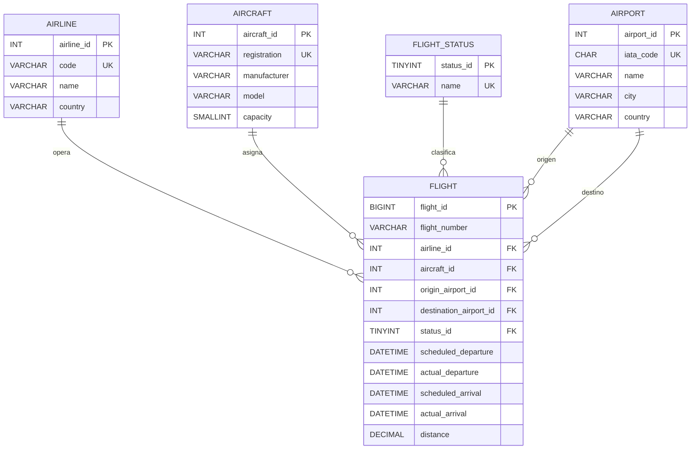
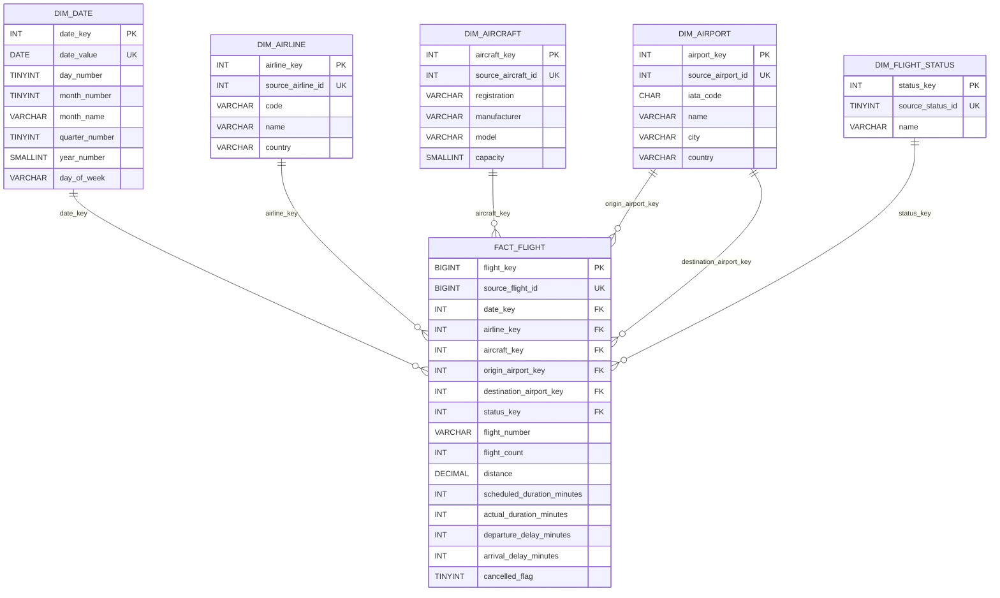

# Flight ETL Pipeline

## 1. Descripcion

Proyecto académico que implementa un proceso ETL modular en Python. Extrae datos del sistema OLTP `flight_management`, los transforma con Pandas y los carga de forma idempotente en el Data Warehouse MySQL `flight_analytics`. Docker proporciona un entorno reproducible con MySQL, el esquema OLTP, datos de prueba y el pipeline.

## 2. Objetivo

Demostrar un pipeline completo, ejecutable con un único comando, con responsabilidades separadas para Extract, Transform, Load, conexiones a base de datos, logging y orquestación.

## 3. Arquitectura ETL



`FlightETLPipeline` orquesta las tres etapas. La carga se realiza en una transacción: primero dimensiones, luego resolución de surrogate keys y finalmente la tabla de hechos.

### Proceso ETL detallado



## 4. Tecnologias

- Python 3.11+
- Pandas
- SQLAlchemy
- PyMySQL
- python-dotenv
- MySQL
- logging nativo de Python
- Docker y Docker Compose

## 5. Estructura del proyecto

```text
flight-etl-pipeline/
├── src/
│   ├── database/connection.py       # Engines centralizados
│   ├── extract/mysql_extractor.py  # Lectura OLTP hacia DataFrames
│   ├── transform/dimensions.py     # Dimensiones y DimDate
│   ├── transform/flights.py        # Limpieza y métricas de vuelos
│   ├── load/mysql_loader.py        # UPSERT y surrogate keys
│   └── pipeline.py                 # Orquestación ETL
├── sql/init_oltp.sql                # DDL de la fuente OLTP
├── sql/seed_oltp.sql                # Datos simulados OLTP
├── sql/init_olap.sql                # DDL del Data Warehouse
├── docs/INFORME_ENTREGA.md           # Informe académico y checklist de entrega
├── tests/                            # Pruebas unitarias y de integración
├── logs/.gitkeep
├── Dockerfile
├── compose.yaml
├── .env.example
├── .gitignore
├── main.py
├── pyproject.toml
└── uv.lock
```

## 6. Base OLTP de origen

La fuente es `flight_management`, con las tablas `airline`, `airport`, `aircraft`, `flight_status` y `flight`. `sql/init_oltp.sql` crea este esquema para el entorno Docker y `sql/seed_oltp.sql` lo puebla con 21 aerolíneas, 31 aeropuertos, 31 aeronaves, 6 estados y 10.047 vuelos. Incluye vuelos finalizados, retrasados, programados, en curso y cancelados distribuidos entre 2026 y 2033. La extracción de vuelos incluye un JOIN con `flight_status` para derivar `cancelled_flag` durante la transformación.

La semilla también incluye registros sucios intencionales, exclusivamente para practicar el ETL. Después de limpiar dimensiones, se esperan 20 aerolíneas, 30 aeropuertos y 30 aeronaves válidas. De los 10.047 vuelos origen, 10.017 deben alcanzar `fact_flight`; 30 se descartan por reglas de calidad.

El DDL OLTP mantiene claves primarias y foráneas, pero no aplica `CHECK` sobre reglas que el pipeline debe demostrar, como distancia positiva, aeropuertos distintos, capacidad positiva y orden de horarios. En producción esas reglas deberían protegerse también en la fuente; aquí se dejan deliberadamente al ETL con fines académicos.



## 7. Modelo OLAP de destino

El esquema estrella `flight_analytics` tiene las dimensiones `dim_date`, `dim_airline`, `dim_airport`, `dim_aircraft` y `dim_flight_status`, junto con `fact_flight`.

El grano de `fact_flight` es una fila por vuelo del sistema OLTP. `dim_airport` es una dimensión reutilizada en los roles de origen y destino mediante `origin_airport_key` y `destination_airport_key`.



## 8. Extract

`MySQLExtractor` solo consulta la fuente y retorna DataFrames de Pandas. No aplica reglas de negocio ni escribe en la base de datos.

## 9. Transform

Las transformaciones se implementan principalmente con Pandas:

- Convierte las cuatro fechas de vuelo a `datetime`.
- Normaliza espacios, elimina espacios externos y convierte cadenas vacías a nulas.
- Elimina duplicados por las claves naturales de dimensiones y por `flight_id` en vuelos.
- Valida campos requeridos.
- Descarta vuelos con distancia no positiva, mismo aeropuerto de origen y destino, o llegada programada no posterior a salida programada.
- Descarta vuelos con llegada real anterior a la salida real cuando ambas fechas existen.
- Valida que el estado operacional sea conocido y consistente con las fechas reales: `Programado` y `Cancelado` no pueden tener actividad real; `En curso` requiere salida real sin llegada; `Finalizado` requiere ambas fechas reales.
- Valida que las claves de aerolínea, aeronave, aeropuertos y estado sobrevivan la limpieza de sus dimensiones antes de cargar hechos.
- Registra un reporte de calidad con conteos de faltantes, duplicados y rechazos por cada regla aplicada.
- Calcula duraciones programada y real en minutos.
- Calcula retrasos de salida y llegada en minutos; conserva `NULL` cuando no existe la fecha real necesaria.
- Calcula `cancelled_flag` cuando el estado es `Cancelado`.
- Genera `dim_date` desde `scheduled_departure`, con `date_key` en formato `YYYYMMDD`.

## 10. Load e idempotencia

`MySQLLoader` utiliza `INSERT ... ON DUPLICATE KEY UPDATE` con las claves naturales definidas para cada dimensión y `source_flight_id` para hechos. Por tanto, ejecutar `python main.py` repetidamente actualiza filas existentes sin duplicarlas.

Tras cargar dimensiones, el loader consulta sus pares `source_id -> surrogate_key` y los asigna al DataFrame de hechos antes de insertar `fact_flight`. Si una clave no puede resolverse, se genera un error y se revierte la transacción de carga.

## 11. Ejecución con Docker

Docker es la forma recomendada de ejecutar el proyecto completo. Requiere Docker Desktop o Docker Engine con Docker Compose.

```bash
docker compose up --build -d
docker compose logs -f etl
```

El primer comando construye la imagen Python, crea el contenedor MySQL y ejecuta automáticamente, una vez, el ETL cuando MySQL supera su healthcheck. MySQL publica el puerto `3307` del host para evitar conflictos con una instalación local en `3306`.

El usuario de MySQL es `root` y la contraseña por defecto es `flight_etl_password`. Puede cambiarla antes de iniciar:

```bash
MYSQL_ROOT_PASSWORD=a_strong_local_password docker compose up --build -d
```

Para ejecutar otra carga sin reinicializar los datos:

```bash
docker compose run --rm etl
```

Para reiniciar completamente MySQL, el esquema y los datos semilla:

```bash
docker compose down -v
docker compose up --build -d
```

Este reinicio es necesario después de cambiar `sql/seed_oltp.sql`, porque MySQL solo ejecuta scripts de inicialización al crear el volumen. La semilla contiene datos sucios controlados para aprendizaje; no debe reutilizarse como patrón de carga para producción.

Los scripts SQL de MySQL solo se ejecutan al crear el volumen por primera vez. Los logs del pipeline también quedan disponibles en `logs/flight_etl.log` del host.

## 12. Configuración local

Desde la raíz del proyecto, cree `.env` a partir del ejemplo:

```bash
cp .env.example .env
```

Complete los valores con las credenciales locales de MySQL:

```dotenv
DB_HOST=localhost
DB_PORT=3306
DB_USER=root
DB_PASSWORD=your_password

OLTP_DATABASE=flight_management
OLAP_DATABASE=flight_analytics
```

`.env` está excluido por Git y no debe contener credenciales compartidas.

## 13. Instalación local

```bash
cd flight-etl-pipeline
uv sync --group dev
```

`pyproject.toml` declara las dependencias de aplicación y el grupo `dev`; `uv.lock` bloquea las versiones resueltas para instalaciones reproducibles.

## 14. Calidad de código

Ruff es el linter y formateador del proyecto. Su configuración vive en `pyproject.toml` y aplica las siguientes reglas:

- Docstrings en módulos, funciones, clases y métodos públicos.
- Longitud máxima de 100 caracteres por línea.
- Imports ordenados y separados por grupos.
- Comillas dobles consistentes mediante el formateador.
- Errores frecuentes, simplificaciones, convenciones modernas de Python y nombres.
- Uso seguro de logging y detección de patrones de seguridad comunes.
- Reglas `pandas-vet` para detectar patrones mejorables en DataFrames.

Formatear y revisar el proyecto:

```bash
uv run ruff format .
uv run ruff check .
```

Aplicar correcciones automáticas que Ruff pueda resolver de forma segura:

```bash
uv run ruff check . --fix
```

Para verificar que el formato ya es correcto sin modificar archivos:

```bash
uv run ruff format --check .
```

## 15. Pruebas con pytest

El proyecto usa `pytest` para proteger las reglas de transformación y la idempotencia del pipeline.

- Las pruebas unitarias validan limpieza de dimensiones, calendario, métricas de vuelo y rechazos por calidad. No requieren MySQL ni Docker.
- La prueba de integración ejecuta el pipeline dos veces contra MySQL Docker y confirma que `fact_flight` no se duplica.
- El único marcador definido es `integration`, utilizado para identificar las pruebas que requieren MySQL. La expresión anterior `not integration` no era un marcador, sino una forma de selección de pytest y ya no se usa en la documentación.

Ejecutar solo pruebas unitarias, sin requerir Docker:

```bash
uv run pytest tests/unit
```

Ejecutar únicamente la integración contra Docker:

```bash
uv run pytest -m integration
```

Para ejecutar la suite completa, MySQL Docker debe estar activo. La prueba de integración usa `localhost:3307` y las credenciales Docker por defecto, sin depender de `.env`:

```bash
docker compose up -d mysql
uv run pytest
```

Si cambió la contraseña o los nombres de base de datos en Docker, sobrescriba la configuración de la prueba con variables `TEST_`, por ejemplo:

```bash
TEST_DB_PASSWORD=mi_password_local uv run pytest
```

## 16. Creación manual de bases de datos

Para ejecutar sin Docker, cree y cargue la fuente OLTP, luego cree el destino OLAP:

```bash
mysql -u root -p < sql/init_oltp.sql
mysql -u root -p < sql/seed_oltp.sql
mysql -u root -p < sql/init_olap.sql
```

Use otro usuario u host si corresponde a su configuración. Los scripts crean ambas bases, sus tablas, claves primarias, claves foráneas y restricciones.

## 17. Ejecución local

```bash
uv run python main.py
```

Los mensajes se muestran en consola y se guardan en `logs/flight_etl.log`. Ante una excepción, el error se registra, la carga transaccional se revierte y el proceso termina con código distinto de cero.

Ejemplo de salida:

```text
2026-09-26 10:00:00 [INFO] Starting Flight ETL Pipeline
2026-09-26 10:00:00 [INFO] Connecting to OLTP database
2026-09-26 10:00:01 [INFO] 12 airlines extracted
2026-09-26 10:00:02 [INFO] Calculating flight metrics for 10542 valid flights
2026-09-26 10:00:03 [INFO] Loaded 10542 rows into fact_flight
2026-09-26 10:00:03 [INFO] ETL Pipeline completed successfully
```

## 18. Validación

Ejecute las siguientes consultas en `flight_analytics`. La primera compara el total de vuelos válidos del origen con la tabla de hechos; replica las reglas de calidad del pipeline.

```sql
SELECT
    (SELECT COUNT(*)
     FROM flight
     WHERE distance > 0
       AND origin_airport_id <> destination_airport_id
       AND scheduled_arrival > scheduled_departure) AS valid_oltp_flights,
    (SELECT COUNT(*) FROM flight_analytics.fact_flight) AS fact_flights;
```

```sql
SELECT a.name, COUNT(*) AS total_flights
FROM fact_flight AS f
JOIN dim_airline AS a ON f.airline_key = a.airline_key
GROUP BY a.name
ORDER BY total_flights DESC;
```

```sql
SELECT a.name, ROUND(AVG(f.departure_delay_minutes), 2) AS avg_departure_delay_minutes
FROM fact_flight AS f
JOIN dim_airline AS a ON f.airline_key = a.airline_key
WHERE f.departure_delay_minutes IS NOT NULL
GROUP BY a.name
ORDER BY avg_departure_delay_minutes DESC;
```

```sql
SELECT
    origin.iata_code AS origin,
    destination.iata_code AS destination,
    COUNT(*) AS total_flights
FROM fact_flight AS f
JOIN dim_airport AS origin ON f.origin_airport_key = origin.airport_key
JOIN dim_airport AS destination ON f.destination_airport_key = destination.airport_key
GROUP BY origin.iata_code, destination.iata_code
ORDER BY total_flights DESC;
```

Para comprobar idempotencia, ejecute `python main.py` dos veces y vuelva a ejecutar la primera consulta: el conteo de `fact_flight` debe mantenerse estable.
